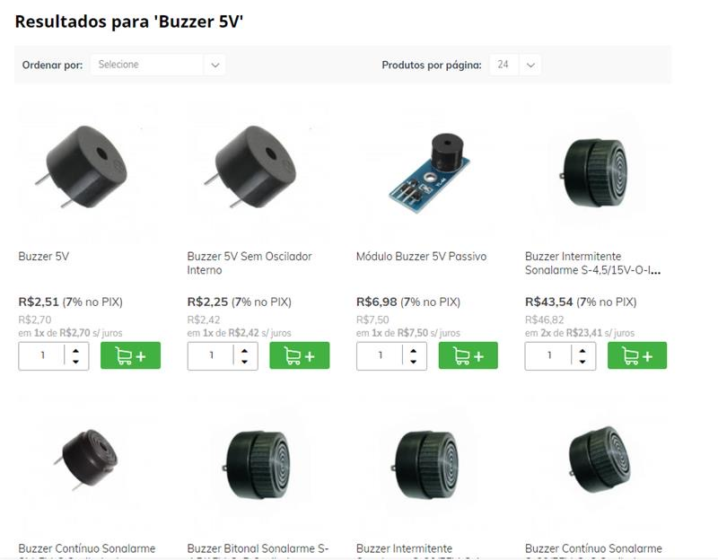
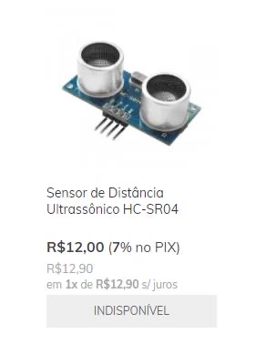
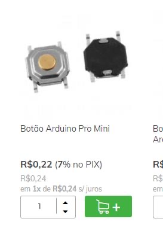
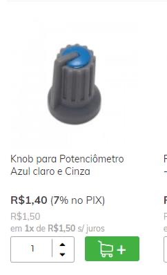
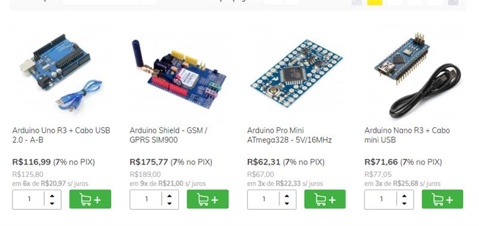

## Abril
### Semana 1 (01/04/2022 – 08/04/2022)
Começamos a pesquisar os valores dos componentes que serão necessários para o desenvolvimento do projeto. Visitamos sites de compra para realizar orçamento dos produtos juntamente a sua viabilidade de obtenção:  
Sites visitados:  
[eltrogate.com](https://www.eletrogate.com/?gclid=EAIaIQobChMI5_zwpY3X9gIVkoKRCh243QlEEAAYAiAAEgKD3_D_BwE)  
[baudaeletronica.com](https://www.baudaeletronica.com.br/arduino?gclid=EAIaIQobChMI5_zwpY3X9gIVkoKRCh243QlEEAAYASAAEgJO1PD_BwE)

### Semana 2 e 3 (08/04/2022 – 22/04/2022)
Realizamos durante estas semanas a pesquisa de projetos que possuem alguma similaridade ao nosso, para que possamos ter exemplos e ideias que auxiliem no desenvolvimento do tapete inteligente.  
[Sensor de treino](https://www.feitodeiridium.com.br/sensor-treino/)    
[Aparelho de Abdominal](https://produto.mercadolivre.com.br/MLB-1374605526-aparelho-de-abdominal-perder-barriga-academia-em-casa-wct-_JM)  
[Sensores inteligentes](https://br.fashionnetwork.com/news/Novos-sensores-inteligentes-em-tecidos-monitoram-a-saude-e-exercicios,706529.html#:~:text=Agora%2C%20sensores%20em%20pe%C3%A7as%20funcionais,movimento%20sejam%20impressos%20sobre%20tecidos.)

### Semana 4 (08/04/2022 – 22/04/2022)
Nesta semana foram feitas mais progressões no desenvolvimento do código no Inkercad. Nós redefinimos os valores lidos pelo potênciometro, convertendo para uma escala mais "real". 

>//Variável:
>int contador = 0;
>bool acont = false; // auxiliar do contador;
>
>//configurar sensor ultrassônico:
>#define trigg 13
>#define echo 12
>int distancia;
>
>//configurar potenciometro:
>int potenciometro_inicial;
>int potenciometro;
>
>//configurar lcd:
>#include <LiquidCrystal.h>
>LiquidCrystal lcd(7, 6, 5, 4, 3, 2);
>
>//configurar led:
>int led = 8;
>
>//configurar botão:
>int valor;
>int botao = 10;
>int estadoButton = 0;
>int anterior = 0;
>int estado = LOW;
>int bt = 1;
>
>//conexões hardware:
>void setup(){
>Serial.begin(9600);//monitor seria
>pinMode(trigg, OUTPUT);//ultrassônico
>pinMode(echo, INPUT);//ultrassônico
>//Potenciômetro:
>pinMode(A0, INPUT);
>
>//led:
>pinMode(led, OUTPUT);
>//botao:
>pinMode(botao, INPUT);
>}
>
>//função principal:
>void loop(){
>//ler potenciometro:
>potenciometro_conversao();
>Serial.println(potenciometro);
>//chama função do botão:
>bt_ligar();
>}
>
>//Função que liga e desliga, faz o botão chamar as outras funções:
>void bt_ligar(){
>valor = digitalRead(botao);
>if (valor == HIGH && anterior == LOW) {
>estado = !estado;
>contador = 0;
>lcd.clear();
>lcd.print(contador);
>}funcao_principal();
>
>digitalWrite(led, estado);
>anterior = valor;
>delay (50);
>}
>
>void funcao_principal(){
>distancia = ultrassom();
>
>if((potenciometro-3) <= distancia && distancia <= (potenciometro+3)){
>acont = true;
>}
>if(!((potenciometro-3) <= distancia && distancia <= (potenciometro+3))){
>if(distancia<potenciometro){
>acont = false;
>}
>
>if(acont == true){
>contador = contador + 1;
>Serial.println(contador);
>lcd.setCursor(0,0);
>lcd.print(contador);
>}
>acont = false;
>}
>}
>
>//Função para converter a distância em cm:
>int ultrassom(){
>
>int duracao; // armazena o valor de tempo em us;
>digitalWrite(trigg, HIGH); //saída do trigger em níve alto;
>
>delayMicroseconds(10); // envia pulso de 10 us;
>digitalWrite(trigg, LOW); //saída para trigger voltar ao núvel baixo;
>duracao = pulseIn (echo, HIGH); //mede o tempo do HIGH;
>return duracao/58.82; //calcula e retorna o valor da distância em cm.
>}

Também solucionamos um problema em relação a inicialização de contagem da variável e como ela é apresentada no lcd
