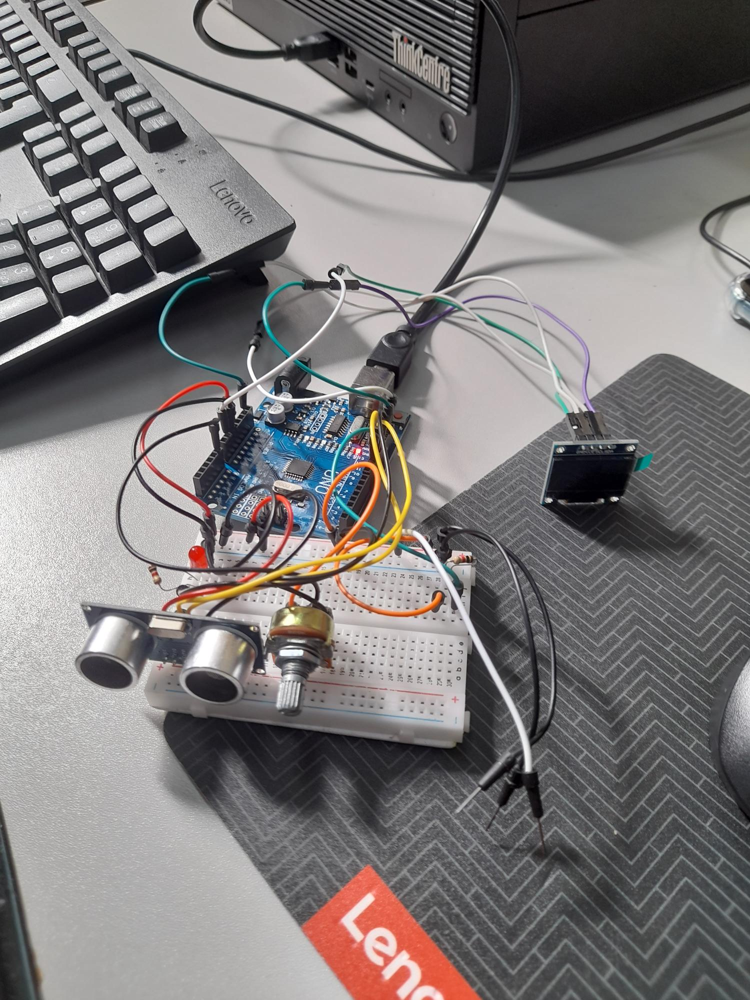

## Agosto

### Semana 1 (29/07/2022 – 05/08/2022)
Realizamos testes com o funcionamento da programação e do sensor de movimento, o projeto está conseguindo captar os movimentos de modo correto, sem erros.

  

### Semana 2 (05/08/2022 – 12/08/2022)
Solucionamos os problemas de programação do OLED, que será muito importe para gerar uma interatividade para o usuário do tapete, exibindo informações e até pequenas animações.

### Semana 3 (12/08/2022 – 19/08/2022)
Com o hardware e software praticamente finalizados, começamos a estudar a como sera realizado o protótipo físico do tapete.

### Semana 4 (19/08/2022 – 26/08/2022)
Iniciamos a pesquisa de valores do tapete que iremos utilizar, pesquisamos alguns modelos na internet e também em algumas lojas da cidade. Estamos estudando qual a melhor opção para ser utilizada, entre EVA, tapetes térmicos e outras opções.

### Semana 5 (26/08/2022 – 02/09/2022)
Realizamos a compra do tapete e iniciamos um projeto 3D pelo Tinkercad, que será impresso em uma impressora 3D. Este projeto consiste em uma peça onde serão colocados o Arduino e as outras partes de hardware do projeto.
