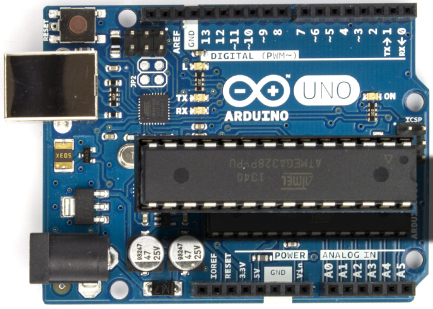

# Diário de Bordo – Tapete Inteligente

Danilo Antunes, Isabella Santos, Luiz Henrique Alves, Laura Niely e Vinicius Cabral

## Fevereiro
### Semana 1 (03/02/2022 – 09/02/2022)
Desenvolvimento do tema. Mapeamento das possibilidades e dos temas que possuem apelo e que podem ajudar a resolver problemas.

### Semana 2 (10/02/2022 – 17/02/2022)
Conclusão do tema. Um tapete integrado a um sistema de Arduino com sensores para ajudar e "gameficar" a realização de exercícios físicos.

### Semana 3 (18/02/2022 – 25/02/2022)
Planejamento dos requisitos. Estudo dos componentes necessários e das maiores dificuldades para realizar o projeto.

### Semana 4 (25/02/2022 – 28/02/2022)
Início do desenvolvimento dos aspectos visuais e das descrições que serão usadas na documentação.
