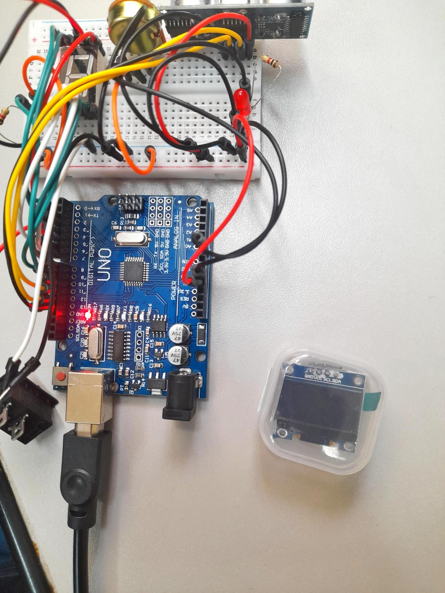

## Julho

### Semana 1 (01/07/2022 – 08/07/2022)
Depois de finalizada a montagem do Arduino, nós estamos trabalhando no código, principalmente na parte do display, para deixar o melhor possível.

### Semana 2 (08/07/2022 – 15/07/2022)
Os computadores não estavam reconhecendo a placa, por isso tivemos que trabalhar nessa semana para resolver esse problema.

### Semana 3 (15/07/2022 – 22/07/2022)
Estudamos o tipo de programação que será utilizada no OLED para mostrar as informações e realizar as animações na tela.

### Semana 4 (22/07/2022 – 29/07/2022)
Adquirimos o OLED e realizamos a montagem em conjunto com a placa. Estamos trabalhando para solucionar os problemas da programação do OLED.

  
