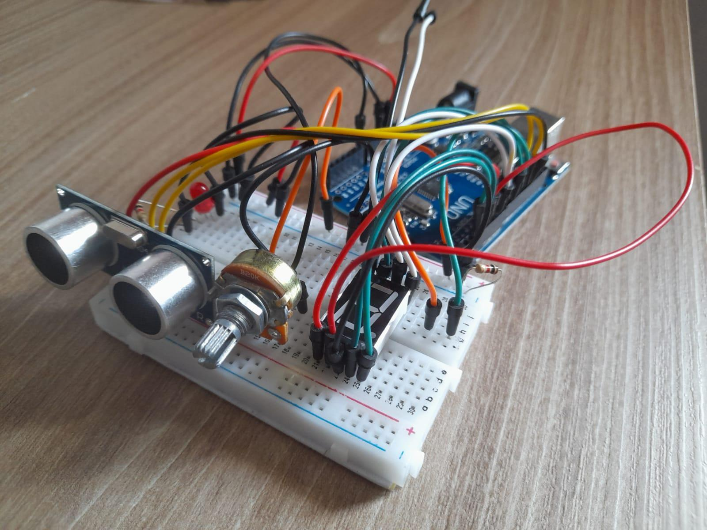

## Junho
### Semana 1 (03/05/2022 – 10/06/2022)
Com a chegada dos componentes, começamos a estudar como faremos a
montagem do Arduino.

### Semana 2 (10/06/2022 – 17/06/2022)
Avançamos com a montagem do Arduino, já com todos os componentes prontos, faltando apenas o OLED, que será colocado futuramente.

  

### Semana 3 (17/06/2022 – 24/06/2022)
Utilizamos essa semana para otimizarmos o código, com o Arduino quase pronto precisamos deixar o código do melhor jeito possível.

### Semana 4 (24/06/2022 – 01/07/2022)
Finalizamos a montagem do Arduino, e também criamos uma função para o display exibir o contador, para isso utilizamos o seguinte código:

```
//Função que zera a variável:
void bt_ligar(){
  valor = digitalRead(botao);
  if (valor == HIGH && anterior == LOW) {
    contador = 0;
    dplay();
    //**lcd.clear();
    //**lcd.print(contador);
  }
}

//função de contagem:
void funcao_principal(){
  if((potenciometro-3) <= distancia && distancia <= (potenciometro+3)){
    acont = true;
  }
  if(!((potenciometro-3) <= distancia && distancia <= (potenciometro+3))){
    if(distancia<potenciometro){
      acont = false;
    }

    if(acont == true){
      contador = contador + 1;
      Serial.println(contador);
      dplay();
      //**lcd.setCursor(0,0);
      //**lcd.print(contador);
    }
    acont = false;
  }
}

//funções do display 7 segmentos
void dplay(){
  if(contador == 0){
    digitalWrite(E,HIGH);
    digitalWrite(D,HIGH);
    digitalWrite(C,HIGH);
    digitalWrite(DP,LOW);
    digitalWrite(B,HIGH);
    digitalWrite(A,HIGH);
    digitalWrite(F,HIGH);
    digitalWrite(G,HIGH);
  }

  if(contador == 1){
    digitalWrite(E,HIGH);
    digitalWrite(D,HIGH);
    digitalWrite(C,LOW);
    digitalWrite(DP,HIGH);
    digitalWrite(B,LOW);
    digitalWrite(A,HIGH);
    digitalWrite(F,HIGH);
    digitalWrite(G,HIGH);
  }

  if(contador == 2){
    digitalWrite(E,LOW);
    digitalWrite(D,LOW);
    digitalWrite(C,HIGH);
    digitalWrite(DP,HIGH);
    digitalWrite(B,LOW);
    digitalWrite(A,LOW);
    digitalWrite(F,HIGH);
    digitalWrite(G,LOW);
  }

  if(contador == 3){
    digitalWrite(E,HIGH);
    digitalWrite(D,LOW);
    digitalWrite(C,LOW);
    digitalWrite(DP,HIGH);
    digitalWrite(B,LOW);
    digitalWrite(A,LOW);
    digitalWrite(F,HIGH);
    digitalWrite(G,LOW);
  }
  
  //Seguindo assim para os demais números do contador...
}
```
