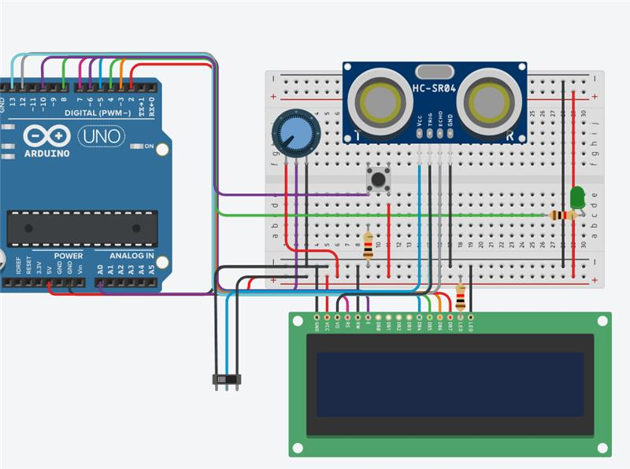

## Maio
### Semana 1 (29/04/2022 – 06/05/2022)
Utilizamos ferramentas como o Google Acadêmico e o Scielo para procurar trabalhos com informações úteis para o nosso projeto.
Focamos no tema "Educação Física" e "Exercícios Físicos".  
Encontramos os seguintes trabalhos:
- [Trabalho 1](http://rdu.unicesumar.edu.br/handle/123456789/5291)  
- [Trabalho 2](https://dl.acm.org/doi/abs/10.1145/2632048.2636088)
- [Trabalho 3](https://revista.uniandrade.br/index.php/revistauniandrade/article/view/136)  
- [Trabalho 4](https://rbafs.org.br/RBAFS/article/view/875/1153)
- [Trabalho 5](https://ubibliorum.ubi.pt/handle/10400.6/10182)
- [Trabalho 6](https://www.scielo.br/j/rbem/a/R46f6xRQ35WDwpmM53bHHzd/?lang=pt)
- [Trabalho 7](https://www.scielo.br/j/rbme/a/jRn4KrPT5r6WbG3Q4CWXsgt/?lang=pt)

### Semana 2 (06/05/2022 - 13/05/2022)
Nessa semana, foi testado um novo formato no código, onde utilizamos um interruptor que liga e desliga o tapete.  
Imagem e código:

  

```
//Variável:
int contador = 0;
bool acont = false; // auxiliar do contador;

//configurar sensor ultrassônico:
#define trigg 13
#define echo 12
int distancia;

//configurar potenciometro:
int potenciometro_inicial;
int potenciometro;

//configurar lcd:
#include <LiquidCrystal.h>
LiquidCrystal lcd(7, 6, 5, 4, 3, 2);

//configurar led:
int led = 8;

//configurar botão:
int valor;
int botao = 10;
int estadoButton = 0;
int anterior = 0;
bool estado = LOW;
int bt = 1;

//conexões hardware:
void setup(){
Serial.begin(9600);//monitor seria
pinMode(trigg, OUTPUT);//ultrassônico
pinMode(echo, INPUT);//ultrassônico
//Potenciômetro:
pinMode(A0, INPUT);

//led:
pinMode(led, OUTPUT);
//botao:
pinMode(botao, INPUT);
}

//função principal:
void loop(){
//ler potenciometro:
potenciometro_conversao();
Serial.println(potenciometro);
//chama função do botão:
bt_ligar();
}

//Função que liga e desliga, faz o botão chamar as outras funções:
void bt_ligar(){
valor = digitalRead(botao);
if (valor == HIGH && anterior == LOW) {
estado = !estado;
contador = 0;
lcd.clear();
lcd.print(contador);
}funcao_principal();

digitalWrite(led, estado);
anterior = valor;
delay (50);
}

void funcao_principal(){
distancia = ultrassom();

if((potenciometro-3) <= distancia && distancia <= (potenciometro+3)){
acont = true;
}
if(!((potenciometro-3) <= distancia && distancia <= (potenciometro+3))){
if(distancia<potenciometro){
acont = false;
}

if(acont == true){
contador = contador + 1;
Serial.println(contador);
lcd.setCursor(0,0);
lcd.print(contador);
}
acont = false;
}
}

//Função para converter a distância em cm:
int ultrassom(){

int duracao; // armazena o valor de tempo em us;
digitalWrite(trigg, HIGH); //saída do trigger em níve alto;

delayMicroseconds(10); // envia pulso de 10 us;
digitalWrite(trigg, LOW); //saída para trigger voltar ao núvel baixo;
duracao = pulseIn (echo, HIGH); //mede o tempo do HIGH;
return duracao/58.82; //calcula e retorna o valor da distância em cm.
}

//Função para converter valor do Potênciometro:
int potenciometro_conversao(){

potenciometro_inicial = analogRead(A0);

if(potenciometro_inicial<166){
potenciometro = 5;
}

if(potenciometro_inicial > 163 && potenciometro_inicial<350){
potenciometro = 10;
}

if(potenciometro_inicial > 347 && potenciometro_inicial<513){
potenciometro = 15;
}

if(potenciometro_inicial > 510 && potenciometro_inicial<677){
potenciometro = 20;
}

if(potenciometro_inicial > 674 && potenciometro_inicial<861){
potenciometro = 25;
}

if(potenciometro_inicial > 858 && potenciometro_inicial<1022){
potenciometro = 30;
}

if(potenciometro_inicial > 1021){
potenciometro = 35;
}

}
```

### Semana 3 (13/05/2022 - 20/05/2022)
Iniciamos a introdução do projeto, utilizando as normas ABNT de citação direta e indireta. Pesquisamos referências sobre os temas de saúde e esporte que envolvem o nosso projeto. Falamos um pouco sobre o treinamento funcional e os benefícios que ele proporciona.

>Na contemporaneidade, em meio à era digital, é imprescindível o reforço da importância de exercícios físicos e todos os benefícios que ele traz. Conforme afirma a >pesquisa de Macedo (2012), a prática de atividades físicas melhora significantemente a qualidade de vida, desde seu estado geral de saúde até aspectos físicos e >mentais.  
>Já é comum a utilização de tapetes sensoriais e outros produtos para o tratamento com crianças autistas (GUIDELLI e SILVA, 2019). Mesmo que funcionando de forma >diversa, o projeto do Tapete Inteligente será capaz de ajudar pessoas de faixas etárias diversas em procedimentos motores e musculares, além de tratar e prevenir >doenças crônicas como, por exemplo, a obesidade, pneumonia, hipertensão e diabetes.  
>Ter saúde depende de vários fatores e, entre eles, inclui-se a prática constante de atividades físicas. Uma das ações mais empregadas atualmente é o treinamento >funcional, que envolve sua capacidade funcional, como o equilíbrio, agilidade e a coordenação e desenvolve a aptidão neuro motora do corpo, aperfeiçoando todas as >aptidões do sistema musculoesquelético e refletindo, dessa maneira, nas melhorias das atividades cotidianas e dos gestos esportivos específicos. Além disso, também >promove benefícios ao bem-estar, saúde, estética e desempenho, propiciando o equilíbrio entre a estabilidade do central do corpo, o controle neuromuscular e neuro >motor. (NOVAES, GIL e RODRIGUES, 2014).  
>Conforme afirma Freitas (2015), a intervenção aplicada com o Método Pilates tanto em solo quanto em aparelhos foi suficiente para gerar alterações significativas na >composição corporal, na flexibilidade, na resistência muscular e na resistência cardiorrespiratória, além de melhorar o perfil psicológico de mulheres sedentárias.
>Em suma, essa técnica se mostra cada vez mais eficiente e benéfico para a saúde e o desenvolvimento físico da população, além de que é uma modalidade que pode ser >aplicada para qualquer faixa-etária.  
>
>Referências:
>MACEDO, C. de S. G.; GARAVELLO, J. J.; OKU, E. C.; MIYAGUSUKU, F. H.; AGNOLL, P. D.; NOCETTI, P. M. BENEFÍCIOS DO EXERCÍCIO FÍSICO PARA A QUALIDADE DE VIDA. Revista >Brasileira de Atividade Física & Saúde, [S. l.], v. 8, n. 2, p. 19–27, 2012. DOI: 10.12820/rbafs.v.8n2p19-27. Disponível em: >https://rbafs.org.br/RBAFS/article/view/875. Acesso em: 9 maio. 2022.  
>GUIDELLI, Kellen Dianny Pinheiro; SILVA, Nathalia Maria. Tapete sensorial como meio de estimulação de crianças com Síndrome de Down - Estudo de caso. 25f. 2019. >Artigo apresentado ao curso de graduação em Fisioterapia da UniCesumar – Centro Universitário de Maringá, 2019. Disponível em: >http://rdu.unicesumar.edu.br/handle/123456789/5291. Acesso em: 9 maio. 2022.  
>FREITAS, Maria Ludmila Menezes de. Comparação dos efeitos do método Pilates realizado em solo e aparelho sobre a aptidão física relacionada à saúde e fatores >psicológicos em mulheres sedentárias. 2015. 58 f. Dissertação (Mestrado em Educação Física) - Universidade Católica de Brasília, Brasília, 2015. Disponível em: >https://bdtd.ucb.br:8443/jspui/handle/tede/1966. Acesso em: 9 maio. 2022  

