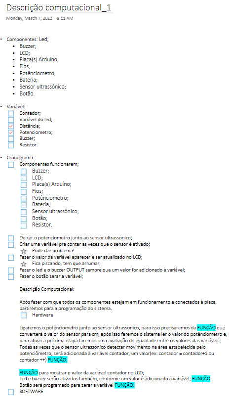
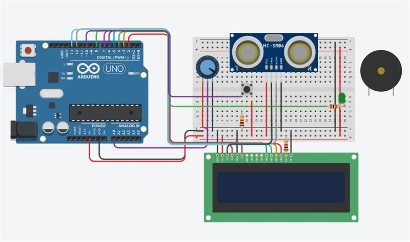
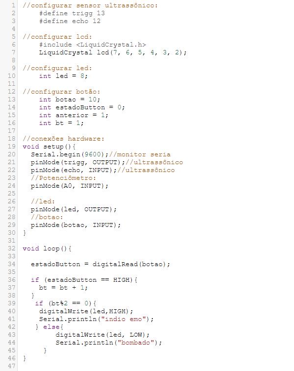

## Março
### Semana 1 (04/03/2022 – 11/03/2022)  
Neste período, iniciamos a criação do repositório no GitHub, começamos a alterar a parte visual do site, para deixarmos tudo organizado e registrado lá.

### Semana 2 (11/03/2022 - 18/03/2022)  
Fizemos toda a descrição computacional do projeto, tudo o que precisaremos, anotamos tudo isso em um PDF em formato de checklist para termos controle ao longo do projeto:

### Semana 3 (18/03/2022 - 25/03/2022)  
Desenvolvimento aprofundado sobre a justificativa do tema. Definimos pontos como:
* Público-alvo
* Problemas que o projeto resolve
* Cenários em que nosso projeto auxilia.

Essas conclusões foram úteis para termos uma maior noção do propósito do nosso projeto e termos uma evolução no quesito de quais serão os próximos passos.

### Semana 4 (25/03/2022 - 01/03/2022)  
Começamos o desenvolvimento da parte do hardware e também fizemos alguns testes na parte da programação. Ainda serão feitos ajustes para que possamos solucionar alguns problemas do código, como o sensor, que está contabilizando os pontos da maneira errada. Todas as montagens e testes estão sendo feitas pelo Tinkercad.

